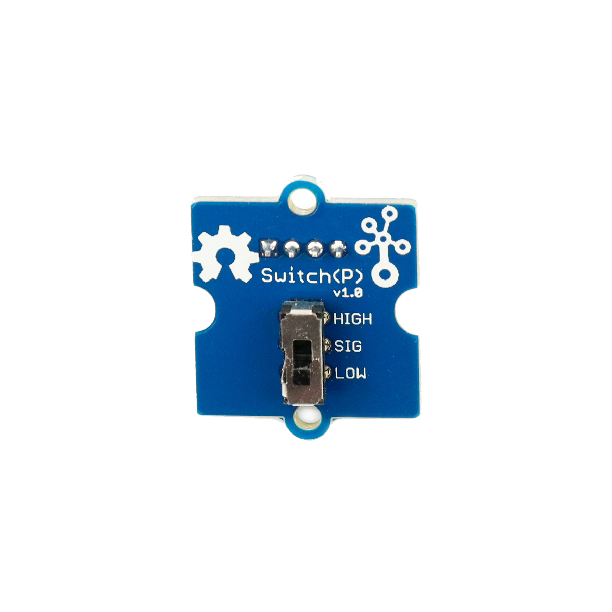

# Schalter

## Beschreibung
Schalter sind eine sehr einfache Eingabemöglichkeit in Elektronik-Projekten. Sie haben einen Schaltmechanismus, der einen elektrischen Kontakt zwischen den Anschlusspins herstellt, sobald der Schalthebel auf die andere Seite geschoben wird. Die vorliegenden Schalter sind bereits auf einer Platine vormontiert und lassen sich dadurch mit Standard-Grove-Verbindungskabeln und direkt mithilfe des Grove Shields an einen Arduino oder Raspberry Pi anschließen. Das Modul benötigt hierfür nur einen digitalen Pin.

### Aufbau

Schließe den Schalter mit einem Grove-Kabel an einen digitalen Pin an. In diesem Beispiel nehmen wir den Pin `D2`. Damit wir irgendetwas schalten können, schließe außerdem eine LED (am schnellsten geht ein LED-Sockel) an `D6` an, so wie im Bild. Dann nehme den Beispielcode von unten und probiere den Schalter aus! Wenn du alles richtig angeschlossen hast, kannst du per Schalter dann die LED an- und ausschalten.

### Weitere Informationen

Alle weiteren Hintergrundinformationen sowie ein Beispielaufbau und alle notwendigen Programmbibliotheken sind auf dem offiziellen Wiki (bisher nur in englischer Sprache) von Seeed Studio zusammengefasst. Zusätzlich findet man über alle gängigen Suchmaschinen meist nur mit der Eingabe der genauen Komponenten-Bezeichnungen entsprechende Projektbeispiele und Tutorials.

## Beispiele

!!!show-examples:./examples/

<!-- infolist -->

## Wichtige Links für die ersten Schritte:

- [Seeed Studio Wiki - Schalter](http://wiki.seeedstudio.com/Grove-Switch-P/)

## Weiterführende Hintergrundinformationen:

- [GPIO - Wikipedia Artikel](https://de.wikipedia.org/wiki/Allzweckeingabe/-ausgabe)
- [GitHub-Repository: Schalter](https://github.com/MakeYourSchool/61-Schalter)

